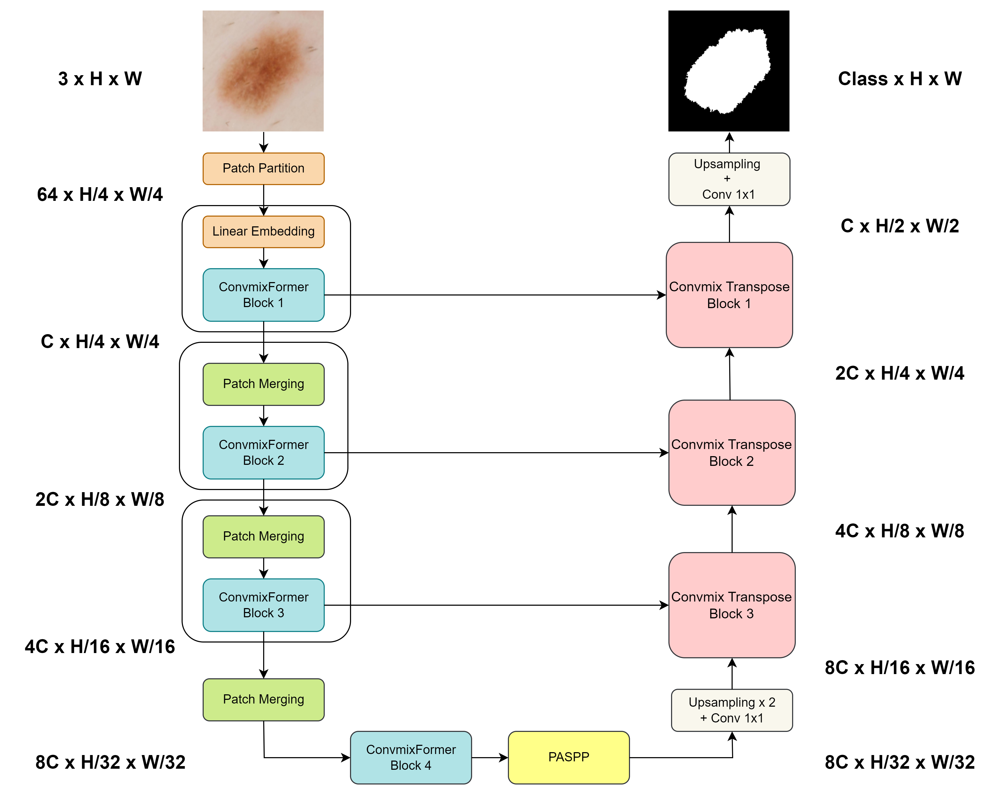
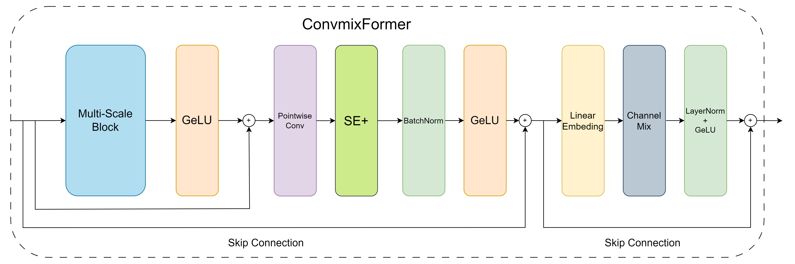
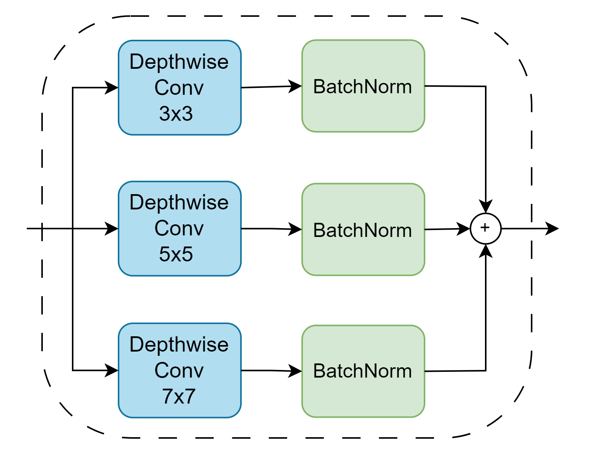
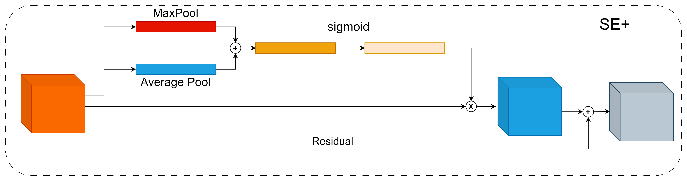
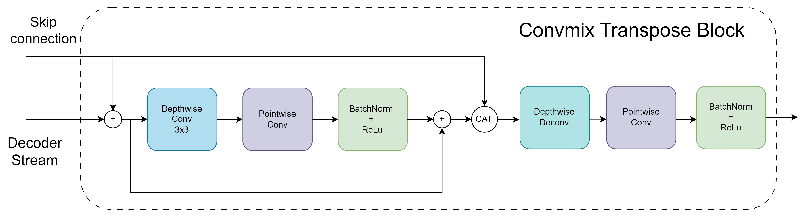

# ConvmixFormer-Unet: A New Approach for Medical Image Segmentation based on Convmixer and Transformer
This is the official code for [ConvmixFormer Unet](https://ieeexplore.ieee.org/document/10382399). 
## Introduction
The research community has shown a great interest in transformer-based structures because of their capacity to understand contextual data and dependencies over long distances, even though they demand substantial computational resources. To overcome this challenge, the MLP-mixer approach offers an alternative to attention token-mix by employing MLP and transpose operations and the results are promising. This ap- proach also showed advantages over the CNN-based models that utilize local information but often neglect global contexts. In the current study, we introduce a novel segmentation model called ConvmixFormer Unet, which leverages the strengths of the Former structure and a CNN-based network. Our model incorporates the ConvmixFormer block in the encoder stage, where the Former structure is utilized by substituting the token-mix layer with a Multi-scale ConvMixer token-mix block while retaining the channel-mix layer. The Convmix Transpose blocks are also proposed in the decoder stage. We assess the effectiveness of our proposed method by employing three distinct datasets, namely GlaS, Data Science Bowl 2018, and ISIC 2018. Additionally, we evaluate our approach against the most advanced models. The findings demonstrate that our proposed model achieves a significant improvement in performance while reducing remarkably the overall number of model parameters.

## Methodology
- General structure of ConvmixFormer Unet

- ConvMixFormer block

- Multi-scale block

- Squeeze and Excite block 

- Decoder block


## How to use
### Installation
```bash
git clone https://github.com/ZQuang2202/ConvmixFormer-UNet.git
pip install -r requirements.txt
```

### Train
```bash
export CUDA_VISIBLE_DEVICE=0 & python3 train.py \
    --x-train-dir ./data/x_train.npy \
    --y-train-dir ./data/y_train.npy \
    --x-test-dir ./data/x_test.npy \
    --y-test-dir ./data/y_test.npy \
    --x-val-dir ./data/x_val.npy \
    --y-val-dir ./data/y_val.npy \
    --exp ./exp/
    --lr 1e-4 \
    --epoch 150 \
    --swa-start 100 \
    --batch-size 8
```

### Test
```bash
export CUDA_VISIBLE_DEVICES=0 & python3 test.py \
    --x-test-dir ./data/x_test.npy \
    --y-test-dir ./data/y_test.npy \
    --check-point-path ./check_point.pth.tar
```

## Results

### Comparative evaluation results of the proposed approach and well-known previous approaches on ISIC18
| **Models**                                  | **Params** (**M**)  | **Results**|           |
| :-----------------------------------------: | :----------------:  | :---------:| :--------:|
|                                             |                     | **Dice**   | **IoU**   |
| UNet                                        | 31.1                | 89.35      | 80.80     |
| TransUnet                                   | 105.3               | 91.04      | 84.74     |
| SwinUnet                                    | 27.2                | 89.46      | 81.05     |
| MedT                                        | 1.6                 | 83.89      | 79.64     |
| AttSwinUnet                                 | 46.3                | 91.05      | 83.56     |
| AMG-Mixer                                   | 22.3                | 91.21      | 83.91     |
| ConvmixFormer (Ours)                        | 8.6                 | **91.73**  | **84.54** |

###  omparative evaluation results of the proposed model and previously proposed approaches on the Gland Segmentation dataset and Data Science Bowl 2018 dataset
| **Models**       | **Params** **(M)**        | **GlaS**   |            | **Bowl**   |            |
| :--------------: | :-----------------------: | :--------: | :--------: | :--------: | :--------: |
|                  |                           | **Dice**   | **IoU**    | **Dice**   | **IoU**    |
| U-Net            | 31\.1                     | 80\.84     | 68\.99     | 90\.60     | 83\.27     |
| MedT             | 1\.6                      | 81\.02     | 69\.61     | 91\.72     | 84\.75     |
| MLP-Mixer        | 101                       | 82\.83     | 70\.81     | 91\.84     | 85\.14     |
| AxialAttMLPMixer | 29\.2                     | 84\.99     | 73\.97     | 92\.35     | 85\.83     |
| AMG-Mixer        | 22\.3                     | 87\.24     | 77\.61     | 92\.47     | 86\.04     |
| Ours proposed    | 8\.6                      | **90\.01** | **82\.61** | **92\.67** | **86\.43** |

### Ablation study
#### Kernel size
| **Kernel\_size** | **Params** <br> ** (M)** | **GlaS**   |            | **Bowl**   |            | **ISIC**   |            |
| :--------------: | :----------------------: | :--------: | :--------: | :--------: | :--------: | :--------: | :--------: |
|                  |                          | **Dice**   | **IoU**    | **Dice**   | **IoU**    | **Dice**   | **IoU**    |
| 3                | 8\.39                    | 88\.28     | 80\.16     | 92\.08     | 85\.47     | 90\.46     | 82\.67     |
| 5                | 8\.44                    | 89\.75     | 82\.19     | 92\.22     | 85\.71     | 91\.16     | 83\.83     |
| 7                | 8\.51                    | 88\.54     | 80\.40     | 92\.21     | 85\.67     | 90\.75     | 83\.11     |
| 3 + 5            | 8\.47                    | 89\.29     | 81\.15     | 92\.35     | 85\.67     | 91\.47     | 84\.32     |
| 5 + 7            | 8\.54                    | 89\.96     | 82\.54     | 92\.51     | 86\.12     | 91\.00     | 83\.51     |
| 3 + 7            | 8\.59                    | 88\.20     | 79\.91     | 92\.40     | 86\.00     | 91\.39     | 84\.21     |
| 3 + 5 + 7        | 8\.62                    | **90\.01** | **82\.61** | **92\.67** | **86\.43** | **91\.73** | **84\.54** |

#### Channel-mix and Depthwise convolution
| **Datasets** | **Operator**   | **Channel** <br>  **mixing** | **Params**  <br>   (**M**) | **Dice**   | **IoU**    |
| :----------- | :------------: | :--------------------------: | :------------------------: | :--------: | :--------: |
| GlaS         | Normal Conv    | w                            | 88\.6                      | 87\.93     | 82\.87     |
|              |                | w/o                          | 84\.0                      | 89\.60     | 81\.43     |
|              | Depthwise Conv | w                            | 8\.6                       | **90\.01** | **82\.10** |
|              |                | w/o                          | 4\.8                       | 89\.91     | 82\.37     |
| Bowl         | Normal Conv    | w                            | 88\.6                      | 91\.94     | 85\.27     |
|              |                | w/o                          | 84\.0                      | 91\.74     | 84\.89     |
|              | Depthwise Conv | w                            | 8\.6                       | **92\.67** | **86\.43** |
|              |                | w/o                          | 4\.8                       | 92\.09     | 85\.36     |
| ISIC         | Normal Conv    | w                            | 88\.6                      | 90\.82     | 84\.01     |
|              |                | w/o                          | 84                         | 91\.07     | 84\.58     |
|              | Depthwise Conv | w                            | 8\.6                       | **91\.73** | **84\.54** |
|              |                | w/o                          | 4\.8                       | 91\.52     | 85\.35     |

## Citation 
```
@inproceedings{nguyen2023convmixformer,
  title={ConvmixFormer-Unet: A New Approach for Medical Image Segmentation based on Convmixer and Transformer},
  author={Nguyen, Van-Quang and Nguyen, Quang-Huy and Tran, Thi-Thao},
  booktitle={2023 12th International Conference on Control, Automation and Information Sciences (ICCAIS)},
  pages={662--667},
  year={2023},
  organization={IEEE}
}
```
